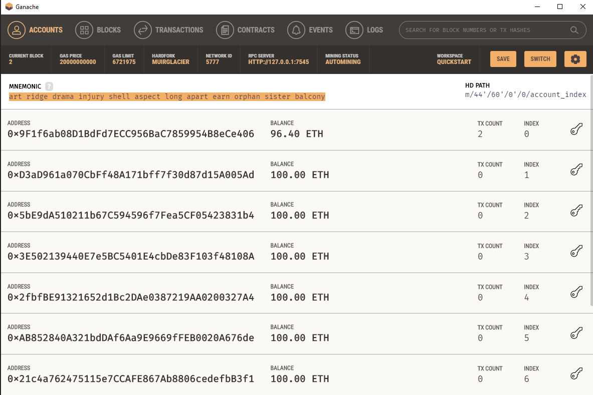

# Cryptocurrency_Wallet
##### Cryptocurrency Wallet used streamlit and Ganache to send transactions

This python code pays job candidates an hourly wage in ethereum employing a web-based streamlit app.

To run this app, The mnemonic from Ganache was code in the .env, and to start the app following command was used

streamlit run fintech_finder.py

